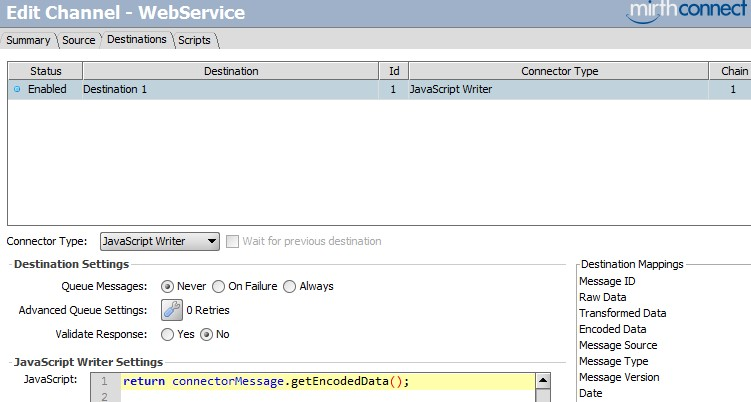
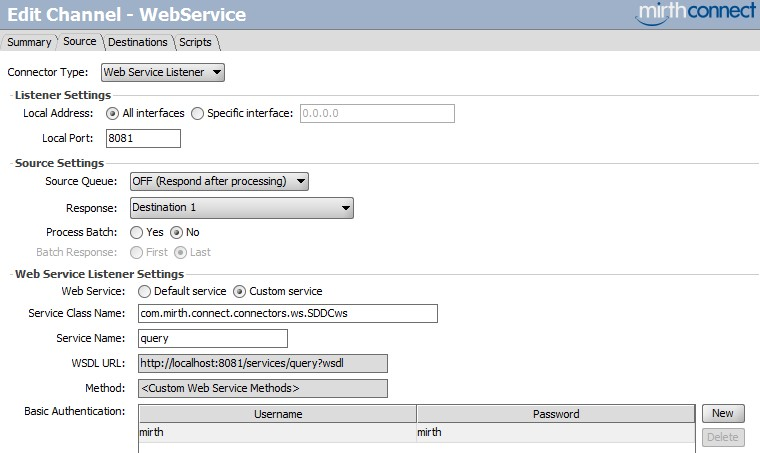

Cet article a été écrit en utilisant la version 3.2 de Mirth.

## Terminologie des web services:

- XML: eXtensible Markup Language, utilisé par les Web Service pour organiser les données.
- SOAP: Simple Object Access Protocol, pour transférer les messages (requête comme réponse)
- WSDL: Web Services Description Language, Pour décrire la disponibilité des services (les méthodes, leurs paramètres et le type des paramètres).
- XSD: XML Schema Definition, décrit les données retournées et leur type.


## Le Web Service Listener de Mirth

Mirth propose par défaut un connecteur Source pour implémenter facilement un web service SOAP. En revanche les possibilités de configuration sont très limitées car les méthodes, paramètres et type de données (WSDL/XSD) sont générés directement depuis la classe Java [com.mirth.connect.connectors.ws.DefaultAcceptMessage](https://github.com/freemed/mirth/blob/master/server/src/com/mirth/connect/connectors/ws/DefaultAcceptMessage.java). Cette classe étends la classe interne `com.mirth.connect.connectors.ws.AcceptMessage`.


Le XSD généré par Mirth:

```XML
<xs:schema version="1.0" targetNamespace="http://ws.connectors.connect.mirth.com/">
  <xs:element name="acceptMessage" type="tns:acceptMessage"/>
  <xs:element name="acceptMessageResponse" type="tns:acceptMessageResponse"/>
  <xs:complexType name="acceptMessage">
    <xs:sequence>
      <xs:element name="arg0" type="xs:string" minOccurs="0"/></xs:sequence>
    </xs:complexType>
  <xs:complexType name="acceptMessageResponse">
    <xs:sequence>
      <xs:element name="return" type="xs:string" minOccurs="0"/>
    </xs:sequence>
  </xs:complexType>
</xs:schema>
```


Le WSDL et XSD sont disponibles aux adresses suivantes:

- [http://localhost:8081/services/query?wsdl](http://localhost:8081/services/query?wsdl)
- [http://localhost:8081/services/query?xsd=1](http://localhost:8081/services/query?xsd=1)


### Scénario Écho

Démonstration de l'utilisation du connecteur source "Web Service Listener":


Le connecteur de destination retourne simplement ce qu'il reçoit:



Pour tester le canal nous devons envoyer notre requête SOAP avec la méthode `AcceptMessage` et le paramètre `arg0` (fichier soap.xml):

```XML
<soapenv:Envelope xmlns:soapenv="http://schemas.xmlsoap.org/soap/envelope/" xmlns:ws="http://ws.connectors.connect.mirth.com/">
  <soapenv:Header/>
  <soapenv:Body>
    <ws:acceptMessage>
      <arg0>test !!</arg0>
    </ws:acceptMessage>
  </soapenv:Body>
</soapenv:Envelope>
```


Pour l'envoi de la requête nous utiliserons curl:

```Console
curl.exe --header "Content-Type: text/xml;charset=UTF-8" --data @soap.xml http://localhost:8081/services/query -u mirth:mirth
```


Le canal nous retourne alors:

```XML
<?xml version="1.0" ?>
<S:Envelope xmlns:S="http://schemas.xmlsoap.org/soap/envelope/" xmlns:SOAP-ENV="http://schemas.xmlsoap.org/soap/envelope/">
  <SOAP-ENV:Header></SOAP-ENV:Header>
  <S:Body>
    <ns2:acceptMessageResponse xmlns:ns2="http://ws.connectors.connect.mirth.com/">
      <return xmlns="">test !!</return>
    </ns2:acceptMessageResponse>
  </S:Body>
</S:Envelope>
```


### Problématiques

- L'enveloppe XML/WSDL/XSD est imposée par `com.mirth.connect.connectors.ws.DefaultAcceptMessage` (par exemple `arg0`, `AcceptMessage` dans la requête SOAP).
- Une seule données peut être transmise via `arg0` à moins d’utiliser un séparateur comme CSV  (utiliser du XML ne respecte pas le standard SOAP et devra être traité via preprocessor dans `<![CDATA[]]>`  pour éviter les problèmes de caractères spécifiques à XML).
Le même problème se pose pour la réponse SOAP (si on utilise du XML dans `return`, les caractères seront remplacés par des caractères HTML.


## Créer son web service à l'aide d'une classe Java (archive JAR)

Pour utiliser notre propre WSDL et XSD, nous pouvons étendre nous même la classe `com.mirth.connect.connectors.ws.acceptMessage`.
Pour cela nous aurons besoin du JDK pour compiler et générer l'archive JAR.

Code source (`SDDCws.java`, le fichier doit avoir le même nom que la classe sinon le compilateur vous le fera savoir!):

```Java
package com.mirth.connect.connectors.ws;

import javax.jws.WebMethod;
import javax.jws.WebParam;
import javax.jws.WebService;

import com.mirth.connect.connectors.ws.AcceptMessage;
import com.mirth.connect.connectors.ws.WebServiceReceiver;


@WebService
public class SDDCws extends AcceptMessage {

  public SDDCws(WebServiceReceiver webServiceReceiver){
    super(webServiceReceiver);
  }

  @WebMethod(operationName = "hello")
  public String hello(@WebParam(name = "name") String txt) {
    txt = "Hello " + txt + " !";
    String response = webServiceReceiver.processData(txt);

    if (response != null) {
      return response;
    }

    return null;
  }
}
```


Il faut bien utiliser `package com.mirth.connect.connectors.ws;` pour étendre la classe `AcceptMessage` qui est dans `com.mirth.connect.connectors.ws` sans quoi le web service retournera l'erreur: "*Méthode de répartition introuvable pour {http://ws.connectors.connect.mirth.com/}hello*"


Il est possible de définir le targetNamespace (par défaut sa valeur est `http://ws.connectors.connect.mirth.com/`), le serviceName et le portName en remplaçant l'annotation `@WebService` par:

```Java
@WebService(portName = "SDDCwsPort", serviceName = "SDDCws", targetNamespace = "https://monurl.qc.ca/monservice")
```


La requête SOAP devra mentionner le bon targetNamespace (`xmlns:ws="https://monurl.qc.ca/monservice"`) dans l'enveloppe sinon nous obtiendrons l'erreur: "*Méthode de répartition introuvable pour {http://ws.connectors.connect.mirth.com/}hello*"


### Compilation de la classe

```Console
"C:\Program Files\Java\jdk1.7.0_80\bin\javac.exe" SDDCws.java -cp "C:\Program Files\Mirth Connect\extensions\ws\ws-server.jar;C:\Program Files\Mirth Connect\server-lib\donkey\donkey-server.jar"
```


`ws-server.jar` est obligatoire pour étendre `AcceptMessage` et `donkey-server.jar` nécessaire si on utilise `webServiceReceiver.processData`.


### Création de l'archive JAR

il faut copier `SDDCws.class` dans `com/mirth/connect/connectors/ws`.

```Console
"C:\Program Files\Java\jdk1.7.0_80\bin\jar.exe" cf SDDCws.jar com\mirth\connect\connectors\ws com
```


Nous obtenons alors `SDDCws.jar`.


### Installation

Copier `SDDCws.jar` dans `C:\Program Files\Mirth Connect\custom-lib`.
Dans Mirth, aller dans Settings > Resources > Reload Resource
`SDDCws.jar` doit apparaître dans la liste « Loaded Librairies » :


### Paramétrer le canal



Après démarrage on peut vérifier le WSDL et XSD:
- http://localhost:8081/services/query?wsdl
- http://localhost:8081/services/query?xsd=1


### Test du canal

Le fichier soap.xml à envoyer avec curl:

```XML
<?xml version="1.0" encoding="UTF-8"?>
<soapenv:Envelope xmlns:soapenv="http://schemas.xmlsoap.org/soap/envelope/" xmlns:ws="http://ws.connectors.connect.mirth.com/">
  <soapenv:Header/>
  <soapenv:Body>
    <ws:hello>
      <name>Test</name>
    </ws:hello>
  </soapenv:Body>
</soapenv:Envelope>
```


Pour envoyer la requête:

```Console
curl.exe --header "Content-Type: text/xml;charset=UTF-8" --data @soap.xml http://localhost:8081/services/query -u mirth:mirth
```


Le canal nous répond alors:

```XML
<?xml version="1.0" ?>
<S:Envelope xmlns:S="http://schemas.xmlsoap.org/soap/envelope/" xmlns:SOAP-ENV="http://schemas.xmlsoap.org/soap/envelope/">
  <SOAP-ENV:Header></SOAP-ENV:Header>
  <S:Body>
    <ns2:helloResponse xmlns:ns2="http://ws.connectors.connect.mirth.com/">
      <return xmlns="">Hello Test !</return>
    </ns2:helloResponse>
  </S:Body>
</S:Envelope>
```


## Web service avancé avec plusieurs paramètres en entrée/sortie

Pour accepter plusieurs paramètres fournis par la requête SOAP, nous allons définir plusieurs paramètres (patseq et name) dans notre classe:

Fichier `SDDCws.java`:

```Java
package com.mirth.connect.connectors.ws;

import javax.jws.WebMethod;
import javax.jws.WebParam;
import javax.jws.WebService;
import com.mirth.connect.connectors.ws.AcceptMessage;
import com.mirth.connect.connectors.ws.WebServiceReceiver;

/* Pour parser le XML */
import java.io.StringReader;
import javax.xml.bind.JAXBContext;
import javax.xml.bind.JAXBException;
import javax.xml.bind.Unmarshaller;


@WebService
public class SDDCws extends AcceptMessage {

  public SDDCws(WebServiceReceiver webServiceReceiver){
    super(webServiceReceiver);
  }

  /* Méthode "getPatient" et ses paramètres en entrée */
  @WebMethod(operationName = "getPatient")
  public Patient getPatient(@WebParam(name = "patseq") String patseq,
                            @WebParam(name = "name") String name,
                            @WebParam(name = "firstName") String firstName,
                            @WebParam(name = "birthDate") String birthDate,
                            @WebParam(name = "ramqId") String ramqId){

    /* Prépare le XML pour le connecteur Source */
    String data = "<?xml version=\"1.0\" encoding=\"UTF-8\"?><patient>";
    data += "<patseq>" + patseq + "</patseq>";
    data += "<name>" + name + "</name>";
    data += "<firstName>" + firstName + "</firstName>";
    data += "<birthDate>" + birthDate + "</birthDate>";
    data += "<ramqId>" + ramqId + "</ramqId>";
    data += "</patient>";

    /* Envoie le XML pour traitement */
    String response = webServiceReceiver.processData(data);
    Patient patient = new Patient();

    /* Parse le XML retourné par le canal pour un objet Patient */
    if (response != null) {
      try {
        JAXBContext jaxbContext = JAXBContext.newInstance(Patient.class);
        Unmarshaller unmarshaller = jaxbContext.createUnmarshaller();
        StringReader reader = new StringReader(response);
        patient = (Patient) unmarshaller.unmarshal(reader);
      } catch (JAXBException e) {
        e.printStackTrace();
      }
    }

    return patient;
  }
}
```


Par défaut ces paramètres ne sont pas obligatoires, si une requête SOAP est envoyée sans certains de ces paramètres il seront ajoutés mais inialisés à `null` (Mirth les verra comme la chaîne `"null"`).
Il est possible de les rendre obligatoire en utilisant `@XmlElement(required=true)` en plus de `@WebParam`.

Ici nous parsons les données de `response` (données issues du connecteur de destination) pour obtenir un objet `patient` qui sera retourné via web service. Si des élément supplémentaires sont présents dans le XML à parser (non présents dans la classe `Patient`) ils seront simplement ignorés.

En effet pour fournir en sortie plusieurs paramètres dans notre réponse SOAP, nous devrons faire appel aux binding Java XML (annotations JAXB) avec `javax.xml.bind.annotation` car retourner simplement un objet `Patient` ne fonctionnera pas (aucune donnée ne sera retournée).

Fichier `Patient.java`:

```Java
package com.mirth.connect.connectors.ws;

import java.io.Serializable;
import javax.xml.bind.annotation.XmlElement;
import javax.xml.bind.annotation.XmlRootElement;
import javax.xml.bind.annotation.XmlType;
import javax.xml.bind.annotation.XmlAccessorType;
import javax.xml.bind.annotation.XmlAccessType;

@XmlRootElement(name = "patient")
@XmlAccessorType(XmlAccessType.NONE) //Pas de binding automatiques
@XmlType(propOrder = { "patseq", "name", "firstName", "birthDate", "ramqId" })
public class Patient implements Serializable{
  private String patseq;
  private String name;
  private String firstName;
  private String birthDate;
  private String ramqId;


  @XmlElement(name = "patseq")
  public String getPatseq() {
    return patseq;
  }

  @XmlElement(name = "name")
  public String getName() {
    return name;
  }

  @XmlElement(name = "firstName")
  public String getFirstName() {
    return firstName;
  }

  @XmlElement(name = "birthDate")
  public String getBirthDate() {
    return birthDate;
  }

  @XmlElement(name = "ramqId")
  public String getRamqId() {
    return ramqId;
  }

  public void setPatseq(String newPatseq) {
    patseq = newPatseq;
  }

  public void setName(String newName) {
    name = newName;
  }

  public void setFirstName(String newFirstName) {
    firstName = newFirstName;
  }

  public void setBirthDate(String newBirthDate) {
    birthDate = newBirthDate;
  }

  public void setRamqId(String newRamqId) {
    ramqId = newRamqId;
  }
}
```


### Compilation, packaging et installation

Accélérons les choses avec un petit script pour obtenir l'archive JAR.

```Console
"C:\Program Files\Java\jdk1.7.0_80\bin\javac.exe" SDDCws.java Patient.java -cp "C:\Program Files\Mirth Connect\extensions\ws\ws-server.jar;C:\Program Files\Mirth Connect\server-lib\donkey\donkey-server.jar"

xcopy /Y .\SDDCws.class .\com\mirth\connect\connectors\ws\
xcopy /Y .\Patient.class .\com\mirth\connect\connectors\ws\

"C:\Program Files\Java\jdk1.7.0_80\bin\jar.exe" cf SDDCws.jar com\mirth\connect\connectors\ws com

xcopy /Y .\SDDCws.jar "C:\Program Files\Mirth Connect\custom-lib\"
```

Dans Mirth, aller dans Settings > Resources > Reload Resource.
Également faire undeploy/deploy sur le canal.


### Test du canal

Ajoutons un `transformer` simple sur le connecteur de destination pour s'assurer que l'ensemble canal + web service fonctionne:

```JavaScript
logger.info("IN: " + msg);
msg['patseq'] = "54980498";
msg['name'] = "Bismuth";
msg['firstName']  = "Paul";
msg['birthDate'] = "1961-04-21";
msg['ramqId'] = "BISP1234567";
logger.info("OUT: " + msg);
```


La requête SOAP (fichier `soap.xml`):

```XML
<?xml version="1.0" encoding="UTF-8"?>
<soapenv:Envelope xmlns:soapenv="http://schemas.xmlsoap.org/soap/envelope/" xmlns:ws="http://ws.connectors.connect.mirth.com/">
  <soapenv:Header/>
  <soapenv:Body>
    <ws:getPatient>
		 <patseq>mon patseq</patseq>
		 <name>name</name>
		 <firstName>firstname</firstName>
		 <birthDate>birthdate</birthDate>
		 <ramqId>ramqid</ramqId>
    </ws:getPatient>
  </soapenv:Body>
</soapenv:Envelope>
```


Envoi avec curl:

```Console
curl.exe --header "Content-Type: text/xml;charset=UTF-8" --data @soap.xml http://localhost:8081/services/query -u mirth:mirth
```


Le canal nous retourne bien les données:

```XML
<?xml version="1.0" ?>
<S:Envelope xmlns:S="http://schemas.xmlsoap.org/soap/envelope/" xmlns:SOAP-ENV="http://schemas.xmlsoap.org/soap/envelope/">
  <SOAP-ENV:Header></SOAP-ENV:Header>
  <S:Body>
    <ns2:getPatientResponse xmlns:ns2="http://ws.connectors.connect.mirth.com/">
      <return xmlns="">
        <patseq>54980498</patseq>
        <name>Bismuth</name>
        <firstName>Paul</firstName>
        <birthDate>1961-04-21</birthDate>
        <ramqId>BISP1234567</ramqId>
      </return>
    </ns2:getPatientResponse>
  </S:Body>
</S:Envelope>
```


Entre temps les WSDL et le XSD sont générés conformément à la classe `SDDCws` et `Patient`.


### Retourner une liste d'objet

Il est possible de retourner une liste d'objet `Patient`. Pour cela nous devons définir une nouvelle classe `PatientList` (dans le fichier `PatientList.java`) qui contiendra des objets `Patient`:

```Java
package com.mirth.connect.connectors.ws;

import java.io.Serializable;
import java.util.ArrayList;

import javax.xml.bind.annotation.XmlElement;
import javax.xml.bind.annotation.XmlRootElement;
import javax.xml.bind.annotation.XmlAccessorType;
import javax.xml.bind.annotation.XmlAccessType;


@XmlRootElement(name = "patientList")
@XmlAccessorType(XmlAccessType.NONE) //Pas de binding automatiques
public class PatientList implements Serializable {

  @XmlElement(name = "patient")
  private ArrayList<Patient> patientList = new ArrayList<Patient>();

  public ArrayList<Patient> getPatientsList() {
    return patientList;
  }

  public void setPatientList(ArrayList<Patient> newPatientList) {
    this.patientList = newPatientList;
  }

  public void addPatient(Patient newPatient) {
    this.patientList.add(newPatient);
  }
}
```


La classe `Patient` (fichier `Patient.java`) n'a besoin d'aucune modification. En revanche il faut ajuster la classe `SDDCws` (fichier `SDDCws.java`) pour parser une liste `PatientList`:

```Java
package com.mirth.connect.connectors.ws;

import javax.jws.WebMethod;
import javax.jws.WebParam;
import javax.jws.WebService;
import com.mirth.connect.connectors.ws.AcceptMessage;
import com.mirth.connect.connectors.ws.WebServiceReceiver;

/* Pour parser le XML */
import java.io.StringReader;
import javax.xml.bind.JAXBContext;
import javax.xml.bind.JAXBException;
import javax.xml.bind.Unmarshaller;


@WebService
public class SDDCws extends AcceptMessage {

  public SDDCws(WebServiceReceiver webServiceReceiver){
    super(webServiceReceiver);
  }

  /* Méthode "getPatient" et ses paramètres en entrée */
  @WebMethod(operationName = "getPatient")
  public PatientList getPatient(@WebParam(name = "patseq") String patseq,
                                @WebParam(name = "name") String name,
                                @WebParam(name = "firstName") String firstName,
                                @WebParam(name = "birthDate") String birthDate,
                                @WebParam(name = "ramqId") String ramqId){

    /* Prépare le XML pour le connecteur Source */
    String data = "<?xml version=\"1.0\" encoding=\"UTF-8\"?><patient>";
    data += "<patseq>" + patseq + "</patseq>";
    data += "<name>" + name + "</name>";
    data += "<firstName>" + firstName + "</firstName>";
    data += "<birthDate>" + birthDate + "</birthDate>";
    data += "<ramqId>" + ramqId + "</ramqId>";
    data += "</patient>";

    /* Envoie le XML pour traitement */
    String response = webServiceReceiver.processData(data);
    PatientList patientList = new PatientList();

    /* Parse le XML retourné par le canal pour une liste d'objet Patient */
    if (response != null) {
      try {
        JAXBContext jaxbContext = JAXBContext.newInstance(PatientList.class);
        Unmarshaller unmarshaller = jaxbContext.createUnmarshaller();
        StringReader reader = new StringReader(response);
        patientList = (PatientList) unmarshaller.unmarshal(reader);
      } catch (JAXBException e) {
        e.printStackTrace();
      }
    }

    return patientList;
  }
}
```


### Compilation, packaging et installation

Il faut ajouter le fichier `PatientList.java`.

```Console
"C:\Program Files\Java\jdk1.7.0_80\bin\javac.exe" SDDCws.java Patient.java PatientList.java -cp "C:\Program Files\Mirth Connect\extensions\ws\ws-server.jar;C:\Program Files\Mirth Connect\server-lib\donkey\donkey-server.jar"

xcopy /Y .\SDDCws.class .\com\mirth\connect\connectors\ws\
xcopy /Y .\Patient.class .\com\mirth\connect\connectors\ws\
xcopy /Y .\PatientList.class .\com\mirth\connect\connectors\ws\

"C:\Program Files\Java\jdk1.7.0_80\bin\jar.exe" cf SDDCws.jar com\mirth\connect\connectors\ws com

xcopy /Y .\SDDCws.jar "C:\Program Files\Mirth Connect\custom-lib\"
```


Dans Mirth, aller dans Settings > Resources > Reload Resource
Également faire undeploy/deploy sur le canal.


### Test du canal

Modifions le `transformer` sur le connecteur de destination pour retourner les données de deux objets `Patient` en XML:

```JavaScript
logger.info("IN: " + msg);

var tmp = new XML('<patientList></patientList>');
tmp.appendChild(new XML('<patient><patseq>54980498</patseq><name>Bismuth</name><firstName>Paul</firstName><birthDate>1961-04-21</birthDate><ramqId>BISP1234567</ramqId></patient>'));
tmp.appendChild(new XML('<patient><patseq>97800135</patseq><name>Norris</name><firstName>Chuck</firstName><birthDate>1945-07-23</birthDate><ramqId>NORC9876541</ramqId></patient>'));

msg = tmp;
logger.info("OUT: " + msg);
```


En renvoyant la même requête que précédemment (les paramètres d'entrée n'ayant pas changé), le canal nous retourne les données suivantes:

```XML
<?xml version="1.0" ?>
<S:Envelope xmlns:S="http://schemas.xmlsoap.org/soap/envelope/" xmlns:SOAP-ENV="http://schemas.xmlsoap.org/soap/envelope/">
  <SOAP-ENV:Header></SOAP-ENV:Header>
  <S:Body>
    <ns2:getPatientResponse xmlns:ns2="http://ws.connectors.connect.mirth.com/">
      <return xmlns="">
        <patient>
          <patseq>54980498</patseq>
          <name>Bismuth</name>
          <firstName>Paul</firstName>
          <birthDate>1961-04-21</birthDate>
          <ramqId>BISP1234567</ramqId>
        </patient>
        <patient>
          <patseq>97800135</patseq>
          <name>Norris</name>
          <firstName>Chuck</firstName>
          <birthDate>1945-07-23</birthDate>
          <ramqId>NORC9876541</ramqId>
        </patient>
      </return>
    </ns2:getPatientResponse>
  </S:Body>
</S:Envelope>
```


## Liens complémentaires

- [http://www.mirthcorp.com/community/wiki/display/mirth/Creating+a+custom+Web+Service+in+Mirth+Connect+3.0.1](http://www.mirthcorp.com/community/wiki/display/mirth/Creating+a+custom+Web+Service+in+Mirth+Connect+3.0.1)
- [https://github.com/freemed/mirth/blob/master/server/src/com/mirth/connect/connectors/ws/DefaultAcceptMessage.java](https://github.com/freemed/mirth/blob/master/server/src/com/mirth/connect/connectors/ws/DefaultAcceptMessage.java)
- [https://howtodoinjava.com/jaxb/jaxb-annotations](https://howtodoinjava.com/jaxb/jaxb-annotations)
- [https://howtodoinjava.com/jaxb/jaxb-exmaple-marshalling-and-unmarshalling-list-or-set-of-objects/](https://howtodoinjava.com/jaxb/jaxb-exmaple-marshalling-and-unmarshalling-list-or-set-of-objects/)
