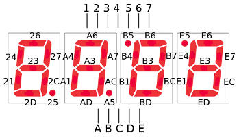

[ [Partie 1](../fpga-afficheur-7-segments-introduction/index.html) | [Partie 2](../fpga-afficheur-7-segments-compteur-unique/index.html) | Partie 3 ]

## Compteur à afficheurs multiples

Nous avons vu dans [la partie 1](../fpga-afficheur-7-segments-introduction/index.html) comment afficher un chiffre sur l'afficheur le plus à droite et dans [la partie 2](../fpga-afficheur-7-segments-compteur-unique/index.html) comment implémenter un compteur avec ce même afficheur. L'objectif de cette troisième partie est d'implémenter un compteur sur plusieurs afficheurs.
Nous commencerons par un compteur à deux afficheurs afin d’introduire les dizaines dans notre compteur et d’afficher des valeurs de 0 à 99. Par la suite, nous étendrons notre compteur aux quatre afficheurs.

Étant limité a une valeur maximale de 9, ajouter un afficheur supplémentaire va nous permettre de rehausser cette valeur à 99.
Un problème se dessine à l’horizon: comment pouvons nous piloter un afficheur supplémentaire indépendamment du premier alors qu’ils partagent les mêmes cathodes?

Rappelons nous notre schéma :




Prenons l’exemple du nombre 21 qui s’affiche avec les segments `{B6, B7, B3, B1, BD}` et `{E7, EC}`.

Ce qui donne en Verilog :

```verilog
display_2_leds <= 9'b111001011;
display_1_leds <= 9'b010000101;
```

Nous obtiendrons sur chacun de nos deux afficheurs les segments des chiffres 1 et 2 en même temps comme s’ils étaient superposés.
Ceci correspond à un OU logique entre `display_1_leds` et `display_2_leds`.

```verilog
	9'b111001011
OU	9'b010000101
----------------
	9’b111001111
```


Ce qui nous donne les segments suivants sur chaque afficheur:

```console
{B6, B7, B3, B1, BD, BC}
{E6, E7, E3, E1, ED, EC}
```

Comment éviter ce comportement? Le seul paramètre indépendant entre nos deux afficheurs est l’anode (respectivement B et E). Cependant l’anode seule ne permet pas de contrôler un segment. L’astuce ici est d’afficher le chiffre 2 sur le second afficheur et alternativement le chiffre 1 sur le premier afficheur. Ces affichages consécutifs à une fréquence suffisamment élevée vont créer l’illusion d’avoir les deux afficheurs fonctionnant simultanément (phénomène de persistance rétinienne, que nous utilisons déjà pour les segments). Pour cela nous réutiliserons notre compteur `counter`.

Nous allons commencer par remanier notre code pour isoler les anodes des cathodes afin de contrôler chaque afficheur séparément (par leur anode respective) et les segments à afficher (par les cathodes).
Pour cela nous aurons besoin de deux sorties avec `output [1:0] DISPLAYS` pour l'anode de chacun des deux afficheurs et 8 autres sorties avec `output [7:0] SEGMENTS` pour la cathodes de chaque segment (en comptant le point).

```verilog
/* module */
module SevenSegment (
	input CLOCK_50,
	output [1:0] DISPLAYS,
	output [7:0] SEGMENTS
);

	/* reg */
	reg [7:0] segments = 8'b0;
	reg [3:0] display_1_value = 4'b0000;
	reg [3:0] display_2_value = 4'b0000;
	reg [3:0] displayed_value = 4'b0000;
	reg [1:0] displays = 2'b0;
	reg [25:0] counter = {26{1'b0}};

	/* assign */
	assign DISPLAYS = displays;
	assign SEGMENTS = segments;

	/* always */
	always @ (posedge CLOCK_50) begin

		//Incrémente le compteur
		counter <= counter + 1'b1;

		//Incrémente la valeur du premier afficheur
		if(counter[24:0] == 25'b1) begin
			display_1_value <= display_1_value + 1'b1;
		end

		//Si on atteint 9
		if(display_1_value[3:0] == 4'b1010) begin

			//On réinitialise la valeur du premier afficheur
			display_1_value <= 4'b0000;

			//Incrémente la valeur du le deuxième afficheur
			display_2_value <= display_2_value + 1'b1;
		end

		//Si on atteint 9, on réinitialise la valeur du deuxième afficheur
		if(display_2_value[3:0] == 4'b1010) begin    
			display_2_value <= 4'b0000;          
		end

		if(counter[18] == 1'b1) begin

			//Active l'anode du premier afficheur seulement
			displays <= 2'b01;

			//Copie la valeur du premier afficheur dans displayed_value
			displayed_value <= display_1_value;  
		end

		if(counter[18] == 1'b0) begin

			//Active l'anode du deuxième afficheur seulement
			displays <= 2'b10;

			//Copie la valeur du deuxième afficheur dans displayed_value  
			displayed_value <= display_2_value;
		end

		//Active les segments selon la valeur affichée
		case(displayed_value[3:0])
			4'b0000 : segments <= 8'b11101011; //0
			4'b0001 : segments <= 8'b01000010; //1
			4'b0010 : segments <= 8'b11100101; //2
			4'b0011 : segments <= 8'b11100110; //3
			4'b0100 : segments <= 8'b01001110; //4
			4'b0101 : segments <= 8'b10101110; //5
			4'b0110 : segments <= 8'b10101111; //6
			4'b0111 : segments <= 8'b01100010; //7
			4'b1000 : segments <= 8'b11101111; //8
			4'b1001 : segments <= 8'b11101110; //9
			default : segments <= 8'b00000000; //Rien
		endcase

	end

endmodule
```

Nous avons fait le choix ici d’utiliser un vecteur de 4 bits `displayed_value` dédié pour l’affichage dans lequel nous copions alternativement la valeur de chacun des afficheurs `display_1_value` et `display_2_value`. Nous aurions pu ajouter directement un bloc `case` sur `display_1_value` et `display_2_value` dans chacun des `if` pour économiser l’espace occupé par `displayed_value`. En revanche cette solution aurait mobilisé davantage d'éléments logiques dans le FPGA (deux blocs `case` au lieu d’un seul).


## Compteur à quatre afficheurs

Maintenant que nous sommes capable de piloter deux afficheurs, il ne reste qu’un pas à franchir pour contrôler les quatre. En utilisant toujours la même technique, nous pouvons étendre facilement le contrôle aux deux afficheurs restant.

Pour alterner l'affichage sur 4 afficheurs nous avons besoin de 2 bits de `counter` pour les identifier individuellement. La position de ces 2 bits dans `counter` permet de définir la fréquence à laquelle l'alternance est effectuée.


```verilog
/* module */
module SevenSegment (
	input CLOCK_50,
	output [3:0] DISPLAYS,
	output [7:0] SEGMENTS
);

	/* reg */
	reg [7:0] segments = 8'b0;
	reg [3:0] display_1_value = 4'b0000;
	reg [3:0] display_2_value = 4'b0000;
	reg [3:0] display_3_value = 4'b0000;
	reg [3:0] display_4_value = 4'b0000;
	reg [3:0] displayed_value = 4'b0000;
	reg [3:0] displays = 4'b0000;
	reg [25:0] counter = {26{1'b0}};

	/* assign */
	assign DISPLAYS = displays;
	assign SEGMENTS = segments;

	/* always */
	always @ (posedge CLOCK_50) begin
		counter <= counter + 1'b1;

		if(counter[20:0] == 21'b1) begin
			display_1_value <= display_1_value + 1'b1;
		end

		if(display_1_value[3:0] == 4'b1010) begin
			display_1_value <= 4'b0000;
			display_2_value <= display_2_value + 1'b1;
		end

		if(display_2_value[3:0] == 4'b1010) begin
			display_2_value <= 4'b0000;
			display_3_value <= display_3_value + 1'b1;
		end

		if(display_3_value[3:0] == 4'b1010) begin
			display_3_value <= 4'b0000;
			display_4_value <= display_4_value + 1'b1;
		end

		if(display_4_value[3:0] == 4'b1010) begin
			display_4_value <= 4'b0000;
		end

		case(counter[18:17])
			2'b11 : begin
				displays <= 4'b0001;
				displayed_value <= display_1_value;
			end
			2'b10 : begin
				displays <= 4'b0010;
				displayed_value <= display_2_value;
			end
			2'b01 : begin
				displays <= 4'b0100;
				displayed_value <= display_3_value;
			end
			2'b00 : begin
				displays <= 4'b1000;
				displayed_value <= display_4_value;
			end
		endcase

		case(displayed_value[3:0])
			4'b0000 : segments <= 8'b11101011; //0
			4'b0001 : segments <= 8'b01000010; //1
			4'b0010 : segments <= 8'b11100101; //2
			4'b0011 : segments <= 8'b11100110; //3
			4'b0100 : segments <= 8'b01001110; //4
			4'b0101 : segments <= 8'b10101110; //5
			4'b0110 : segments <= 8'b10101111; //6
			4'b0111 : segments <= 8'b01100010; //7
			4'b1000 : segments <= 8'b11101111; //8
			4'b1001 : segments <= 8'b11101110; //9
			default : segments <= 8'b00000000; //Rien
		endcase

	end

endmodule
```

Le bloc `case` nous permet de comparer `counter[18:17]` de manière élégante bien qu'une série de 4 `if` aurait parfaitement fonctionné.


[ [Partie 1](../fpga-afficheur-7-segments-introduction/index.html) | [Partie 2](../fpga-afficheur-7-segments-compteur-unique/index.html) | Partie 3 ]
