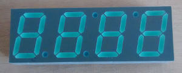
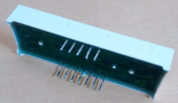
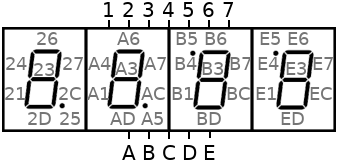
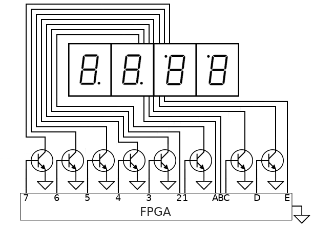
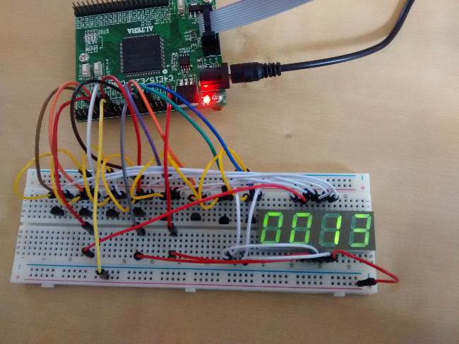
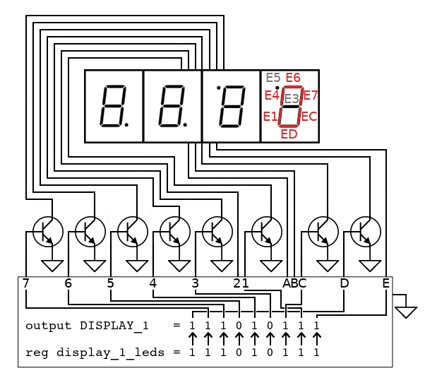

Partie 1, [partie 2](../fpga-afficheur-7-segments-compteur-unique/), [partie 3](../fpga-afficheur-7-segments-compteurs-multiples/)

Dans cette article nous verrons comment piloter un afficheur 7 segments avec un FPGA. L’objectif étant purement pédagogique, il s’agit ici d’un exercice visant la mise en pratique de Verilog pour la description d’un circuit logique simple dont le fonctionnement peut s’observer facilement avec un afficheur 7 segments.

Le soin est laissé au lecteur d’avoir l’équipement et l’environnement de développement fonctionnel.
À titre indicatif, cet article a été rédigé en utilisant un FPGA Cyclone IV EP4CE22E22C8N d’Altera avec [Quartus Prime 17.1.0 Lite](http://fpgasoftware.intel.com/?edition=lite) sous Linux (Fedora 27). Les codes Verilog proposés fonctionneront parfaitement pour d'autres FPGA et environnements tels que Xilinx ou encore Lattice.
L’afficheur 7 segments provient d’un vieux décodeur TV Vidéotron, son circuit nous est pour le moment complètement inconnu ce qui implique de faire un peu de rétro-ingénierie même s’il y a fort à parier que le schéma soit disponible sur Internet.

## Circuit de l’afficheur 7 segments

Pour utiliser un afficheur 7 segments, nous devons d’abord nous attarder sur le fonctionnement de celui-ci. Il s’agit d’un ensemble de diodes électroluminescentes (DEL ou LED en anglais) disposées de façon à pouvoir représenter un chiffre entre 0 et 9 ainsi que certaines lettres.
La principale caractéristique d’une diode est qu’elle ne laisse passer le courant que dans un seul sens : de l’anode (pôle positif) vers la cathode (pole négatif). Les diodes électroluminescentes ont la particularité d’émettre un rayonnement lumineux lorsqu’elles sont traversées par un courant électrique.





Nous avons donc à faire à un composant polarisé: ceci implique de différencier l’anode de la cathode pour chaque segments afin d’établir le schéma de l’afficheur et être en mesure de le faire fonctionner.
Commençons par établir une nomenclature des broches de l’afficheur:


Déterminons les paires de broches permettant d’activer chaque segment. Pour cela nous allons procéder par essai/erreur en appliquant une faible tension (1V suffira) depuis un multimètre ou une autre source de faible intensité comme le FPGA avec ses broches VCC et GND.
Une plaque de prototypage avec des câbles Dupont est recommandée pour cette étape ainsi que pour connecter le FPGA à l'afficheur.

Nous prendrons en note chacun de nos essais afin de nous assurer de tester toutes les combinaisons de broches et leur polarité.
Dès qu’un segment s’allume, nous annoterons sur le schéma les broches correspondantes. Pour respecter le sens de déplacement des électrons (du pôle positif vers le pôle négatif) nous adopterons la convention suivante :

- le premier caractère : anode (pôle positif)
- le deuxième caractère : cathode (pôle négatif)





Rappelons que par convention le premier caractère de chaque segment représente l’anode (pôle positif) et le deuxième la cathode (pôle négatif).
Le schéma obtenu peut différer de celui des autres afficheurs et de celui du lecteur.

Nous sommes maintenant en mesure d’utiliser l’afficheur car nous avons identifié l’anode et la cathode de chaque segment.

On observe que pour chaque afficheur tous les segments possèdent une anode commune. Ainsi le seul moyen de contrôler l’afficheur est d’appliquer une tension sur l’anode (qui est commune) et de relier la cathode des segments voulus à la masse.
Par exemple pour afficher le chiffre 3 sur l’afficheur le plus à droite il faut appliquer une tension sur l’anode E et mettre à la masse les cathodes 6, 7, 3, C et D. Ce qui nous donne les segments {E6, E7, E3, EC, ED}.

Ce mode de fonctionnement va poser un problème de taille : un FPGA n’est pas capable de faire office d’interrupteur pour fermer ou ouvrir le circuit, il peu uniquement générer une tension ou non (un 1 ou un 0). Ce problème se poserait également dans le cas d’un afficheur à cathode commune mais dans une moindre mesure: il y aurait seulement 4 cathodes (une par afficheur) à gérer contre 8 dans notre cas (afficheurs à anode commune).

Pour contourner ce problème, nous allons utiliser un transistor à jonction NPN, le 2N3904, pour chaque cathode. D'autres transistors NPN comme le 2N2222 peuvent être utilisés.



Notez que nous utilisons certaines sorties du FPGA directement comme alimentation pour les anodes 2, A, B et E. Cette configuration n'est pas recommandée mais permet d'obtenir un montage très simple et fonctionnel pour travailler avec un FPGA et Verilog. L'idéal serait d'utiliser une source d'alimentation externe avec une résistance pour chaque cathode en les contrôlant avec un transistor, comme c'est le cas pour les cathodes.
Également, nos 8 transistors pourrait être remplacés pour un circuit [ULN2803A](http://www.ti.com/lit/ds/symlink/uln2803a.pdf) plus compact.




## Pilotage d'un afficheur

Maintenant que nous connaissons l’anode et la cathode de chaque segment, il va falloir les relier aux broches du FPGA et implémenter la partie logique en Verilog qui permettra d’appliquer une tension ou non sur les segments voulus.

Commençons par définir un module nommé SevenSegment avec pour entrée le signal issu de l’horloge du FPGA (50 MHz) et 9 sorties (1 cathode pour chacun des 7 segments, 1 pour l’anode commune et 1 pour la cathode du point). Nous détaillerons plus tard l'utilité du signal d'horloge.

```verilog
/* module */
module SevenSegment (
	input CLOCK_50,
	output [8:0] DISPLAY_1
);
```

Remarquons que l'indexation de `DISPLAY_1` se fait dans le sens inverse des tableaux que l'on retrouve dans des langages tels que le C.
Ainsi, l'indice 0 représente la valeur la plus à droite (bit de poids faible) et l'indice 8 la valeur la plus à gauche (bit de poids fort).
On pourrait dire qu'un registre vectoriel se lit de gauche à droite.
Maintenant que notre module est déclaré, il nous faut un registre capable de stocker 9 bits pour contrôler nos 9 sorties (1 bit par sortie) :

```verilog
/* module */
module SevenSegment (
	input CLOCK_50,
	output [8:0] DISPLAY_1
);

	/* reg */
	//Désactive tout par défaut
	reg [8:0] display_1_leds = 9'b000000000;

	/* assign */
	assign DISPLAY_1[0] = display_1_leds[0]; //E (anode commune)
	assign DISPLAY_1[1] = display_1_leds[1]; //1
	assign DISPLAY_1[2] = display_1_leds[2]; //C
	assign DISPLAY_1[3] = display_1_leds[3]; //3
	assign DISPLAY_1[4] = display_1_leds[4]; //4
	assign DISPLAY_1[5] = display_1_leds[5]; //5 (le point)
	assign DISPLAY_1[6] = display_1_leds[6]; //6
	assign DISPLAY_1[7] = display_1_leds[7]; //7
	assign DISPLAY_1[8] = display_1_leds[8]; //D
endmodule
```

Les assignations registre-sortie vont nous permettre de contrôler l’état des sorties du FPGA en affectant une valeur (0 ou 1) a chaque registre.
Il va falloir indiquer à Quartus quelle sortie de notre module `DISPLAY_1` est assignée à quelle sortie physique du FPGA à l’aide du Pin Planner.

Affichons maintenant le chiffre 0  en activant les sorties reliées aux segments E6, E7, EC, ED, E1 et E4:

```verilog
/* module */
module SevenSegment (
	input CLOCK_50,
	output [8:0] DISPLAY_1
);

	/* reg */
	//Désactive tout par défaut
	reg [8:0] display_1_leds = 9'b000000000;

	/* assign */
	assign DISPLAY_1[0] = display_1_leds[0]; //E (anode commune)
	assign DISPLAY_1[1] = display_1_leds[1]; //1
	assign DISPLAY_1[2] = display_1_leds[2]; //C
	assign DISPLAY_1[3] = display_1_leds[3]; //3
	assign DISPLAY_1[4] = display_1_leds[4]; //4
	assign DISPLAY_1[5] = display_1_leds[5]; //5 (le point)
	assign DISPLAY_1[6] = display_1_leds[6]; //6
	assign DISPLAY_1[7] = display_1_leds[7]; //7
	assign DISPLAY_1[8] = display_1_leds[8]; //D

	/* always */
	always @ (posedge CLOCK_50) begin

		//Active E (anode commune)
		display_1_leds[0] <= 1'b1;

		//Chiffre 0
		display_1_leds[6] <= 1'b1; //Active 6, E6 devient actif
		display_1_leds[7] <= 1'b1; //Active 7, E7 devient actif
		display_1_leds[2] <= 1'b1; //Active C, EC devient actif
		display_1_leds[8] <= 1'b1; //Active D, ED devient actif
		display_1_leds[1] <= 1'b1; //Active 1, E1 devient actif
		display_1_leds[4] <= 1'b1; //Active 4, E4 devient actif

	end

endmodule
```


Il est tout à fait possible de simplifier le code comme suit:

```verilog
/* module */
module SevenSegment (
	input CLOCK_50,
	output [8:0] DISPLAY_1
);

	/* reg */
	//Désactive tout par défaut
	reg [8:0] display_1_leds = 9'b000000000;

	/* assign */
	assign DISPLAY_1 = display_1_leds;

	/* always */
	always @ (posedge CLOCK_50) begin

		//Chiffre 0
		display_1_leds <= 9'b111010111;

	end

endmodule
```
DISPLAY_1 et display_1_leds étant de même taille (9), l'assignation `assign DISPLAY_1 = display_1_leds` se fait bit à bit.
Nous pouvons supprimer l’assignation `display_1_leds[0] <= 1'b1` (anode commune) car nous avons le contrôle de cette valeur dans 11101011**1** (première valeur de `display_1_leds`, donc `display_1_leds[0]`).





En suivant la même logique, on obtient la liste des segments actifs pour afficher respectivement chaque chiffre de 0 à 9 :

```verilog
//Chiffre 0, segments {ED, E7, E6, E4, EC, E1}
display_1_leds <= 9'b111010111;

//Chiffre 1, segments {E7, EC}
display_1_leds <= 9'b010000101;

//Chiffre 2, segments {ED, E7, E6, E3, E1}
display_1_leds <= 9'b111001011;

//Chiffre 3, segments {ED, E7, E6, E3, EC}
display_1_leds <= 9'b111001101;

//Chiffre 4, segments {E7, E4, E3, EC}
display_1_leds <= 9'b010011101;

//Chiffre 5, segments {ED, E6, E4, E3, EC}
display_1_leds <= 9'b101011101;

//Chiffre 6, segments {ED, E6, E4, E3, EC, E1}
display_1_leds <= 9'b101011111;

//Chiffre 7, segments {E7, E6, EC}
display_1_leds <= 9'b011000101;

//Chiffre 8, segments {ED, E7, E6, E4, E3, EC, E1}
display_1_leds <= 9'b111011111;

//Chiffre 9, segments {ED, E7, E6, E4, E3, EC}
display_1_leds <= 9'b111011101;
```

Nous sommes maintenant en mesure d’afficher n’importe quel chiffre sur notre afficheur 7 segments.

Dans [la partie 2](../fpga-afficheur-7-segments-compteur-unique/), nous irons un peu plus loin en implémentant un compteur pour afficher les chiffres de 0 à 9.

Partie 1, [partie 2](../fpga-afficheur-7-segments-compteur-unique/), [partie 3](../fpga-afficheur-7-segments-compteurs-multiples/)
