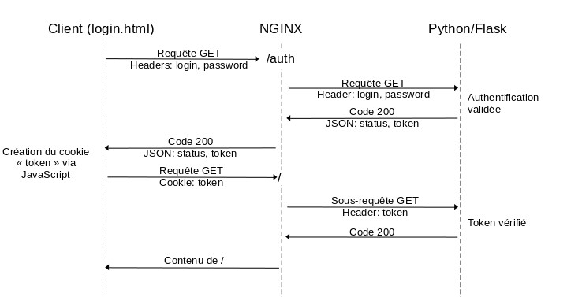

NGINX permet de restreindre l'accès à certaines ressources en effectuant une sous-requête d'authentification. Cette sous-requête doit retourner un code 200 pour autoriser l'accès, un code 403 pour l'interdire.

Il est important de savoir que cette sous-requête ne peut contenir de données autres que des headers et sera uniquement de type GET. Les champs d'un formulaire dans le corp d'une requête POST seront ignorés. Seules les entêtes peuvent être transmises au backend par le biais d'une sous-requête.
NGINX s'attend à recevoir un code HTTP (200 pour un succès, 403 pour un échec) et ne retournera aucune donnée issue de la sous-requêtes (ni corp, ni entêtes).
Ce mécanisme permet d'implémenter des méthodes d'authentification personnalisées.

Ici nous utiliserons Flask (Framework web très léger pour Python) comme backend d'authentification.





Chaque accès au contenu de `/` fera l'objet d'une sous-requête systématique où la validité du token (transmis via les headers) sera établie par le backend.
Ainsi tout accès à `/` sans s'être auparavant authentifié via `/auth` (ou avec un faux token) retournera un code 403 par le backend puis par NGINX au client.

## login.html
```HTML
<!DOCTYPE html>
<html>
<head>
  <title>Authentification</title>
</head>
<body>
  <h1>Authentification</h1>
  <form onsubmit="return false;">
    <input type="text" id="login" placeholder="Identifiant" value="user" required><br>
    <input type="password" id="password" placeholder="Mot de passe" value="user" required><br>
    <input type="submit" value="Connexion" onClick="auth()">
  </form>
</body>

<script>
function auth(){
  var login = document.getElementById('login').value;
  var password = document.getElementById('password').value;
  if(login == '' || password == '')
    return false;

  var http = new XMLHttpRequest();
  var url = "/auth";
  http.open("GET", url, true);
  http.setRequestHeader("Content-type", "application/json");
  http.setRequestHeader("X-Login", login);
  http.setRequestHeader("X-Password", password); 

  http.onreadystatechange = function() {
      if(http.readyState == 4 && http.status == 200) {
          //console.log(http.responseText);
          var json = JSON.parse(http.responseText);
          document.cookie = "token="+json.token+"; path=/";
          window.location.replace("/");
      }
      if(http.readyState == 4 && http.status != 200) {
          //console.log(http.responseText);
          alert("Login ou mot de passe incorrect.");
      }
  }
  http.send("");
}
</script>
</html>
```

## Configuration NGINX

```YAML
server {
	listen       80;
   	server_name  test.reverse;
   	#access_log   logs/domain2.access.log  main;

	root /var/www/html;

	#Pour héberger login.html
	location /login {
		root /var/www/html;
	}

	location / {
		#Authentification	
		auth_request        /auth;
	}

	#Backend d'authentification python
	location /auth {
        proxy_pass                          http://localhost:5000/auth;
        proxy_http_version                  1.1;
        proxy_pass_request_body             off;
        proxy_pass_request_headers          off;

        proxy_set_header                    Content-Length "";
        proxy_set_header                    X-Original-URI $request_uri;

        #Filtre les headers qui seront envoyés vers le backend
        proxy_set_header    X-Login	        $http_x_login;
        proxy_set_header    X-Password	    $http_x_password;
        proxy_set_header    X-TokenCookie	$cookie_token;
	}
}
```

## Backend Python/Flask

Pour installer le nécessaire sous Debian:
```Console
apt-get install python3-flask python3-requests
```

Lancer l'application python:
```Console
FLASK_APP=auth FLASK_DEBUG=0 flask run --host=127.0.0.1 -p 5000
```

Tester l'authentification sans passer par NGINX:
```Console
curl "http://localhost/auth" -H "X-Login: user" -H "X-Password: user"
```

```Python
#!/bin/python3

from flask import Flask
from flask import request, jsonify
import requests
import json

app = Flask(__name__)

#Utilise seulement GET car c'est la méthode utilisé par Nginx pour une sous-requête d'authentification
@app.route('/auth', methods=['GET'])
def auth():

    #Si déjà authentifié (cookie passé via header par Nginx), vérifie le token (via une autre API)
    if 'X-TOKENCOOKIE' in request.headers:
        token = request.headers['X-TOKENCOOKIE']
        r = requests.get("http://autreapi.com/api/checkToken?token=" + token)

        #Si token valide
        if r.status_code == 200:
            result = {'status': 'Authenticated', 'token': request.headers['X-TOKENCOOKIE']}
            return jsonify(result), 200, {'Content-Type':'application/json', 'X-Token':request.headers['X-TOKENCOOKIE']}

        #Si token invalide
        elif r.status_code == 403:
            result = {'status': 'Unauthorized', 'token': ''}
            return jsonify(result), 403, {'Content-Type':'application/json', 'X-Token':''}

        #Tout autre cas de figure
        else:
            result = {'status': 'Unknown', 'token': ''}
            return jsonify(result), 403, {'Content-Type':'application/json', 'X-Token':''}

    #Si première authentification (pas de cookie)
    if 'X-LOGIN' in request.headers and 'X-PASSWORD' in request.headers:
        data_auth = {'username': request.headers['X-LOGIN'], 'password': request.headers['X-PASSWORD']}
        headers = {'Content-Type': 'application/x-www-form-urlencoded'}
        r = requests.post("http://autreapi.com/api/login", data=data_auth, headers=headers)

        #Authentification réussie
        if r.status_code == 200:
            result_auth = json.loads(r.text)
            result = {'status': 'Authenticated', 'token': result_auth['authToken']}
            return jsonify(result), 200, {'Content-Type':'application/json', 'X-Token':result_auth['authToken']}

        #Mauvais login/mot de passe
        elif r.status_code == 403:
            result = {'status': 'Unauthorized', 'token': ''}
            return jsonify(result), 403, {'Content-Type':'application/json', 'X-Token':''}

        else:
            result = {'status': 'Unknown', 'token': ''}
            return jsonify(result), 403, {'Content-Type':'application/json', 'X-Token':''}

    #Si aucune information d'authentification est fournie (ni cookie ni headers)
    else:
        result = {'status': 'Unauthorized', 'token': ''}
        return jsonify(result), 403, {'Content-Type':'application/json', 'X-Token':''}

```


## Liens complémentaires
 - [https://docs.nginx.com/nginx/admin-guide/security-controls/configuring-subrequest-authentication/](https://docs.nginx.com/nginx/admin-guide/security-controls/configuring-subrequest-authentication/)
