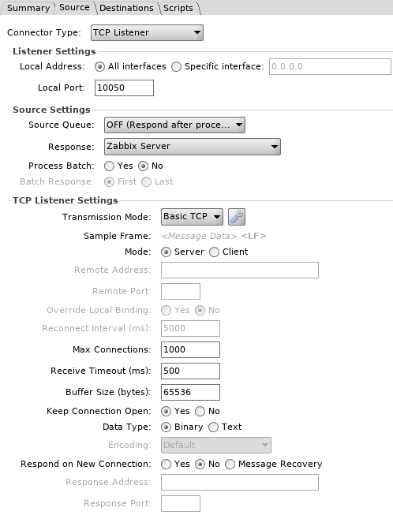

L'objectif est d'implémenter un agent [Zabbix](https://www.zabbix.com/) dans [Mirth Connect](https://www.nextgen.com/products-and-services/NextGen-Connect-Integration-Engine-Downloads) comme n'importe quel autre échange de données afin de monitorer l'activité de ce dernier (erreurs, statuts, volumes de transactions, etc.).
L'intégralité du code source de ce projet est disponible sur Github (licence GPLv3): [https://github.com/cboyer/mirth-zabbix](https://github.com/cboyer/mirth-zabbix).

Le monitoring avec Zabbix repose sur un serveur chargé de collecter les données auprès des équipements notamment via un agent (Zabbix peut également utiliser d'autres standards comme SNMP). Cette stratégie de "polling" implique dans un premier temps une connexion à l'agent pour l'interroger concernant la valeur d'une métrique (clé) que ce dernier lui retournera.


## Le protocole Zabbix

Zabbix utilise un protocole relativement simple: il repose sur des échanges de données au format JSON sur TCP. Étant une technologie libre et open source nous disposons du code source de l'agent Zabbix ainsi qu'une excellente documentation pour en comprendre le fonctionnement (cf. sources en bas de page).

Zabbix structure ses messages de la façon suivante:

```console
<Entête> <Quantité des données> <Données>
```

&nbsp; |Entête|Quantité de données|Données
:-----:|:-----:|:-----:|:-----:
**Type** |Chaîne de caractères|Entier (little endian)|Chaîne de caractères
**Taille** |5 octets|8 octets|Variable, maximum 134217728 octets
**Contenu** |"ZBXD\\x01"|Taille du champ Données|Données de monitoring (JSON)


L'entête est une chaîne de caractères fixe: `"ZBXD\x01"`. Elle est composée de la chaîne `ZBXD` et de l'octet `0x01`.
La quantité de données est un entier non signé sur 8 octets en little-endian qui représente la longueur de la chaîne contenant les données JSON. Zabbix est limité à une quantité maximale de 134217728 octets.
Les données envoyées sont en texte clair au format JSON (Zabbix peut crypter ses échanges, cas que nous ne traiterons pas ici).

## Mirth Connect

Pour imiter le fonctionnement de l'agent Zabbix avec un canal Mirth un connecteur source de type TCP Listener est nécessaire afin d'accepter les connexions en provenance du serveur Zabbix. Ce connecteur doit utiliser la même connexion TCP pour être interroger (recevoir la clé) et envoyer la donnée correspondante à la métrique demandée. Il doit également fonctionner en mode binaire car nous avons besoin de travailler avec des octets sans qu'ils soient altérés par les standards d'encodage (UTF-8, etc.) liés aux chaînes de caractères. Le caractère `0x0A` (LF) sera utilisé comme indicateur de fin de message. Tous ces paramètres sont configurables directement dans Mirth sans la moindre ligne de code.



Une fois le connecteur source mis en place, nous allons faire appel à un [transformer](https://github.com/cboyer/mirth-zabbix/blob/master/src/destination_transformer.js) afin de récupérer les données demandées par le serveur et les transmettre au connecteur de destination. C'est ici que sont centralisées les fonctionnalités de l'agent Zabbix, plus précisément les clés supportées. Concrètement il s'agit un simple `switch` pour exécuter du code en fonction de la métrique demandée par le serveur:

```javascript
switch (item_requested) {

	case 'agent.ping':
		msg = 1;
		break;

	case 'agent.version':
		msg = 'Mirthix ' + agent_version;
		break;

	case 'agent.hostname':
	case 'system.uname':
		msg = com.mirth.connect.server.controllers.ConfigurationController.getInstance().getServerName();
		break;

	default:
		msg = "ZBX_NOTSUPPORTED\x00Key not implemented in Mirthix: " + item_requested;
}
```

Pour le [connecteur de destination](https://github.com/cboyer/mirth-zabbix/blob/master/src/destination.js) (chargé d'envoyer les données au serveur Zabbix), nous devrons implémenter le protocole Zabbix avec le header, la longueur des données sur 8 octets en little-endian et les données.
Voici le code du connecteur de destination:

```javascript
var header = "ZBXD\x01";
var data = connectorMessage.getEncodedData();

var header_bytes = new java.lang.String(header).getBytes('UTF-8');
var data_bytes = new java.lang.String(data).getBytes('UTF-8');

if (data_bytes.length + 1 >= 134217728) { // +1 pour le caractère final 0x0A (LF)
  throw('Message exceeds the maximum size 134217728 bytes.');
}

var length_bytes = Packages.java.nio.ByteBuffer.allocate(8);
length_bytes.order(java.nio.ByteOrder.LITTLE_ENDIAN);
length_bytes.putInt(data_bytes.length + 1); // +1 pour le caractère final 0x0A (LF)

var zabbix_message_bytes = Packages.java.nio.ByteBuffer.allocate(header_bytes.length + length_bytes.array().length + data_bytes.length);
zabbix_message_bytes.put(header_bytes);
zabbix_message_bytes.put(length_bytes.array());
zabbix_message_bytes.put(data_bytes);

return Packages.org.apache.commons.codec.binary.Base64.encodeBase64String(zabbix_message_bytes.array());
```

Notons qu'il est nécessaire d'encoder le message en base 64 pour fonctionner en mode binaire dans Mirth.
Coté Zabbix toute la configuration s'effectue via un [template](https://github.com/cboyer/mirth-zabbix/blob/master/Zabbix/Zabbix_template.xml) pour la définition des items/clés à monitorer.


## Sources

 - [https://www.zabbix.com/documentation/3.4/manual/appendix/items/activepassive](https://www.zabbix.com/documentation/3.4/manual/appendix/items/activepassive)
 - [https://www.zabbix.com/documentation/3.4/manual/appendix/protocols/header_datalen](https://www.zabbix.com/documentation/3.4/manual/appendix/protocols/header_datalen)
